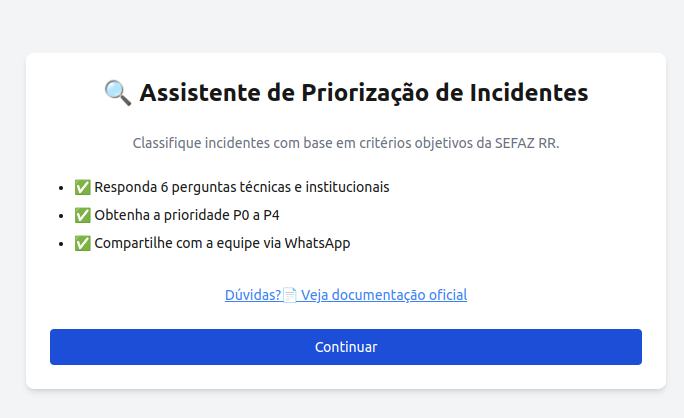

# Assistente de Priorização de Incidentes




> Aplicação web interativa para autoavaliação de criticidade de incidentes com base na Matriz da SEFAZ RR. O objetivo é evitar a priorização subjetiva e fortalecer a cultura de observabilidade.

---

### ✅ Ajustes e melhorias

O projeto está em constante evolução. Próximas tarefas:

- [x] Classificação baseada em perguntas técnicas e institucionais
- [x] Exportação via WhatsApp
- [x] Interface com animações e responsividade
- [x] Redirecionamento automático para o quiz
- [ ] Armazenamento do histórico de classificações
- [ ] Exportação para PDF e/ou planilha
- [ ] Dashboard para múltiplos serviços

---

## 💻 Pré-requisitos

Antes de começar, verifique se você tem:

- Node.js `>=18`
- npm `>=9`
- Sistema operacional: Windows, macOS ou Linux
- Leitura recomendada: [Matriz de Incidentes e Criticidade](https://docs.google.com/document/d/1VGsVyPhKCJdppXdnlSd6tv3OiFSZAvemfgsogdIH8lY)

---

## 🚀 Instalando Assistente de Priorização

Clone o repositório:

```bash
git clone https://github.com/virgiliojr94/assistente-quiz-incidente
cd assistente-quiz-incidente
npm install
```

---

## ☕ Usando Assistente de Priorização

```bash
npm run dev
```

Acesse no navegador:

```
http://localhost:3000/incidente
```

> O quiz exibirá uma sequência de perguntas. Ao final, será calculada a prioridade (P0 a P4) com base nas respostas.

---

## 📫 Contribuindo para Assistente de Priorização

1. Bifurque este repositório
2. Crie sua branch: `git checkout -b feature/nova-funcionalidade`
3. Commit: `git commit -m 'feat: adiciona nova funcionalidade'`
4. Push: `git push origin feature/nova-funcionalidade`
5. Crie o Pull Request

Ou consulte: [como criar uma pull request no GitHub](https://help.github.com/en/github/collaborating-with-issues-and-pull-requests/creating-a-pull-request)

---

## 🤝 Colaboradores

<table>
  <tr>
    <td align="center">
      <a href="https://github.com/virgiliojr94">
        <br>
        <sub><b>Virgílio Borges</b></sub>
      </a>
    </td>
  </tr>
</table>

---


> Se tudo é prioridade... Nada é prioridade!